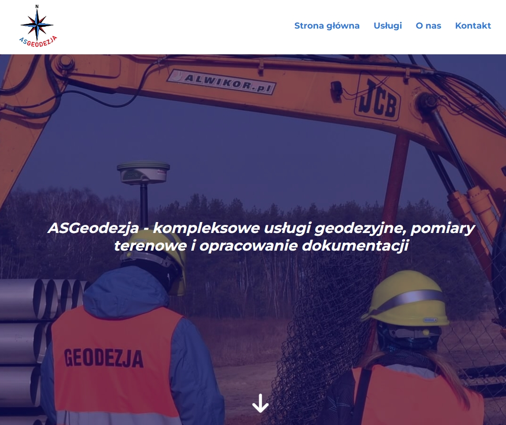
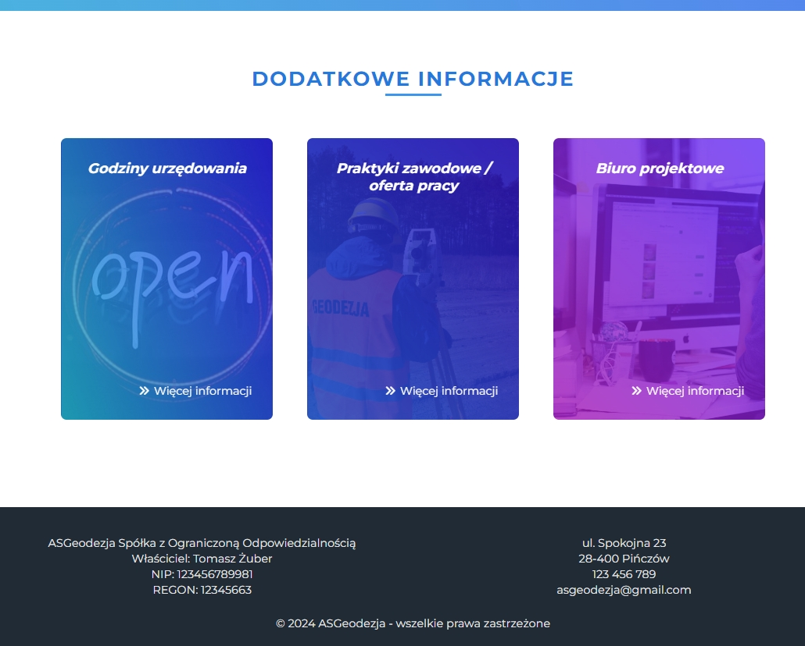
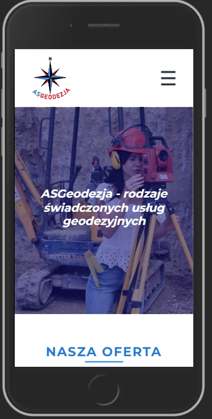

# Geodesy site

Hello, I present to you my website project - completely finished and functional website for geodesy firm. 
I work as a land surveyor in a moment of creating the page, so I decided to develop a website for a made-up geodesic company.
The page is created in **Polish language**.

#### I encourage you to check the website - uploaded to netlifly [ASGeodesy](https://asgeodesy.netlify.app/).

## 📫 Page contains

- main site and three site pages (services, about us and contact),
- custom page 404 and redirects,
- responsive design,
- accessibility practices,
- SEO practices,
- basic design requirements preserved.

## 🛠 Used tools / programming languages / technologies

- HTML / CSS (SCSS),
- JavaScript,
- GULP,
- git / github.

